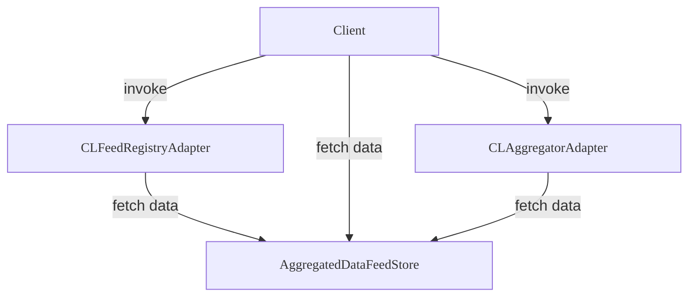

import contractsFileStructure from "@blocksense/contracts/contractsFileStructure.json";
import { ContractsFileTree } from "@/sol-contracts-components/ContractsFileTree";
import { Callout } from "nextra/components";

# Introduction

This document provides a quick-start guide to smart contracts as part of our Blocksense protocol. Here you can get a high-level overview of the architecture and the role of smart contracts in the Blocksense network.

## Folder Structure

Smart contracts for Blocksense network are stored inside our public GitHub repository. The [`contracts`](https://github.com/blocksense-network/blocksense/tree/main/libs/ts/contracts/contracts) folder is organized as presented below:

<ContractsFileTree data={contractsFileStructure} />

## Smart Contracts Architecture

The Blocksense network utilizes a modular architecture, with smart contracts serving as the foundation for data storage and retrieval. The core components of the architecture include:

### Components Overview

- **Client**: Represents users and external systems interacting with the Blocksense protocol.

- **CLFeedRegistryAdapter**: Represents an on-chain mapping of assets, base or quote pairs, to their corresponding feeds. It provides users and clients with Chainlink interface functions to query feed data using asset addresses, eliminating the need-to-know specific feed contract address.

- **CLAggregatorAdapter**: Proxy instance, that allows users and clients to retrieve data for a specific feed through Chainlink interface methods.

- **AggregatedDataFeedStore**: Represents the data feed contract, which stores historical data feed values of different sizes, allowing users to retrieve past data points for specific data feed IDs.

## Core contracts

### AggregatedDataFeedStore (ADFS)

The AggregatedDataFeedStore contract is the core contract responsible for storing and retrieving data feed values. It is designed to be upgradeable, allowing for future contract upgrades and improvements.

<Callout type="warning" emoji="⚠️">
  In practice, the UpgradeableProxyADFS contract is the central storage for all data. The AggregatedDataFeedStore contract provides the logic for reading from and writing to the UpgradeableProxyADFS contract’s storage.
</Callout>

Each data feed is represented by a unique ID, which is used to identify and retrieve the corresponding data feed values. The contract supports multiple data feed sizes as well as historical data in the form of a ring buffer (i.e. the historical data is limited and will be overwritten with new data when the buffer is full).

Data can be stored in any format and in any size (up to ~64GB).

#### Subscribe to update events

When an update is posted to the contract, an event is emitted - “DataFeedsUpdated(uint256 blockNumber)” (topic: `0xe64378c8d8a289137204264780c7669f3860a703795c6f0574d925d473a4a2a7`). Block number is an internal counter for the Blocksense system. Through this event off-chain programs can subscribe to updates and trigger on-chain actions when needed.

#### Read from storage

See the [Integration guide](./integration-guide/using-data-feeds/aggregated-data-feed-store) for more information.

### Access Control

This contract ensures the caller has the necessary permissions to perform specific actions.

### CL Adapters

The [`cl-adapters`](https://github.com/blocksense-network/blocksense/tree/main/libs/ts/contracts/contracts/cl-adapters) folder contains Chainlink aggregator adapter contract ([`CLAggregatorAdapter.sol`](https://github.com/blocksense-network/blocksense/blob/main/libs/ts/contracts/contracts/cl-adapters/CLAggregatorAdapter.sol)) and a feed registry contract ([`/registries/CLFeedRegistryAdapter.sol`](https://github.com/blocksense-network/blocksense/blob/main/libs/ts/contracts/contracts/cl-adapters/registries/CLFeedRegistryAdapter.sol)). The CL aggregator adapter contract implements the Chainlink aggregator interface, enabling it to interact with the [`ADFS`](https://github.com/blocksense-network/blocksense/blob/main/libs/ts/contracts/contracts/AggregatedDataFeedStore.sol) contract to fetch stored data. The feed registry contract is responsible for mapping asset addresses to their corresponding Chainlink data feeds. It provides a mechanism for users to retrieve the address of a specific data feed based on the asset address.

### Interfaces

The [`interfaces`](https://github.com/blocksense-network/blocksense/tree/main/libs/ts/contracts/contracts/interfaces) folder includes the following key interfaces:

- [`ICLAggregatorAdapter.sol`](https://github.com/blocksense-network/blocksense/blob/main/libs/ts/contracts/contracts/interfaces/ICLAggregatorAdapter.sol): Extends the functionality of [`IChainlinkAggregator.sol`](https://github.com/blocksense-network/blocksense/blob/main/libs/ts/contracts/contracts/interfaces/chainlink/IChainlinkAggregator.sol).
- [`/chainlink/IChainlinkAggregator.sol`](https://github.com/blocksense-network/blocksense/blob/main/libs/ts/contracts/contracts/interfaces/chainlink/IChainlinkAggregator.sol): Defines the interface for the Chainlink aggregator contract.
- [`ICLFeedRegistryAdapter.sol`](https://github.com/blocksense-network/blocksense/blob/main/libs/ts/contracts/contracts/interfaces/ICLFeedRegistryAdapter.sol): Extends the functionality of [`IChainlinkFeedRegistry.sol`](https://github.com/blocksense-network/blocksense/blob/main/libs/ts/contracts/contracts/interfaces/chainlink/IChainlinkFeedRegistry.sol).
- [`/chainlink/IChainlinkFeedRegistry.sol`](https://github.com/blocksense-network/blocksense/blob/main/libs/ts/contracts/contracts/interfaces/chainlink/IChainlinkFeedRegistry.sol): Defines the data feed registry contract interface.

### Libraries

The [`libraries`](https://github.com/blocksense-network/blocksense/tree/main/libs/ts/contracts/contracts/libraries) folder contains [`CLAdapterLib.sol`](https://github.com/blocksense-network/blocksense/blob/main/libs/ts/contracts/contracts/libraries/CLAdapterLib.sol) - used as an internal library in [`CLFeedRegistryAdapter`](https://github.com/blocksense-network/blocksense/blob/main/libs/ts/contracts/contracts/cl-adapters/registries/CLFeedRegistryAdapter.sol), [`CLAggregatorAdapter`](https://github.com/blocksense-network/blocksense/blob/main/libs/ts/contracts/contracts/cl-adapters/CLAggregatorAdapter.sol) to call [`ADFS`](https://github.com/blocksense-network/blocksense/blob/main/libs/ts/contracts/contracts/AggregatedDataFeedStore.sol), and [`ADFS.sol`](https://github.com/blocksense-network/blocksense/blob/main/libs/ts/contracts/contracts/libraries/ADFS.sol) - used in the example contracts to demonstrate how the client can query [`ADFS`](https://github.com/blocksense-network/blocksense/blob/main/libs/ts/contracts/contracts/AggregatedDataFeedStore.sol) directly. Both provide utilities for low-level static calls to [`ADFS`](https://github.com/blocksense-network/blocksense/blob/main/libs/ts/contracts/contracts/AggregatedDataFeedStore.sol) or the CL adapters to ensure maximum gas optimizations. Moreover, [`CLAdapterLib`](https://github.com/blocksense-network/blocksense/blob/main/libs/ts/contracts/contracts/libraries/CLAdapterLib.sol) enables historical data parsing handlers to decode raw data from the storage in the form of a Chainlink aggregator, whereas the [`ADFS`](https://github.com/blocksense-network/blocksense/blob/main/libs/ts/contracts/contracts/libraries/ADFS.sol) library is designed for client contracts as a low-gas call library.

## Test Contracts

**[`test`](https://github.com/blocksense-network/blocksense/tree/main/libs/ts/contracts/contracts/test) folder:**
- This folder includes example consumer contracts and reference implementations primarily for gas comparison purposes during testing. These examples provide a basis for evaluation of the gas efficiency.

## Prologue Optimization

### Overview

Prologue optimization aims to reduce gas costs associated with smart contract calls by skipping the Solidity dispatching prologue and instead using the selector as a data feed ID.

### Call Handling Mechanism

All calls are managed by a fallback function based on the selector, ensuring efficient handling of setter and getter operations.

### Key Points

- A custom entry point, that bypasses the Solidity dispatching prologue.
- Selectors utilize reserved bits to determine which function to call, while the remaining bits indicate the data feed they should handle.
- The optimization reduces gas costs by eliminating the need for the Solidity compiler to generate "Linear If-Else Dispatcher" statements for different selectors.

### Benefits

- Reduced gas costs for smart contract calls.
