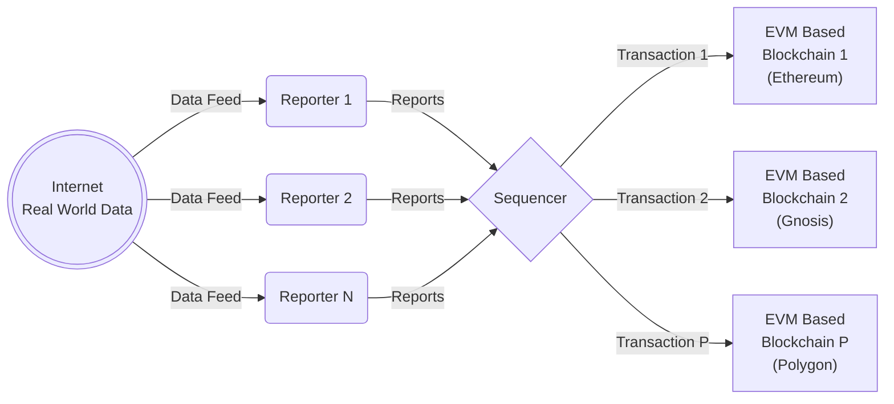

```mermaid
flowchart LR
  A(((Internet <br>Real World Data))) -->|Data Feed| B(Reporter 1)
  A -->|Data Feed| C(Reporter 2)
  A -->|Data Feed| D(Reporter N)
  B -->|Reports| E{Sequencer}
  C -->|Reports| E{Sequencer}
  D -->|Reports| E{Sequencer}
  E -->|Transaction 1| F["EVM Based <br>Blockchain 1<br>(Ethereum)"]
  E -->|Transaction 2| G["EVM Based <br>Blockchain 2<br>(Gnosis)"]
  E -->|Transaction P| H["EVM Based <br>Blockchain P<br>(Polygon)"]
```
