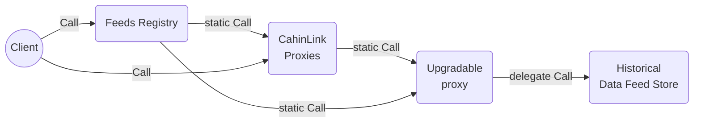

```mermaid
flowchart LR
  A((Client)) -->|Call| B(Feeds Registry)
  B-->|static Call| C(CahinLink<br>Proxies)-->|static Call| D(Upgradable <br>proxy)
  B-->|static Call| D
  D-->|delegate Call| G(Historical <br>Data Feed Store)
  A -->|Call| C
```

