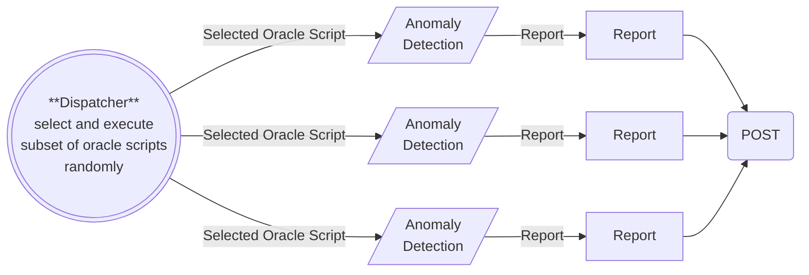

```mermaid
flowchart LR
  A((("**Dispatcher**<br>select and execute <br>subset of oracle scripts <br>randomly"))) -->|Selected Oracle Script| B[/"Anomaly <br>Detection"/]-->|Report| C[Report]--> D(POST)
  A-->|Selected Oracle Script| E[/"Anomaly <br>Detection"/]-->|Report| F[Report]--> D
  A-->|Selected Oracle Script| G[/"Anomaly <br>Detection"/]-->|Report| H[Report]--> D
```

