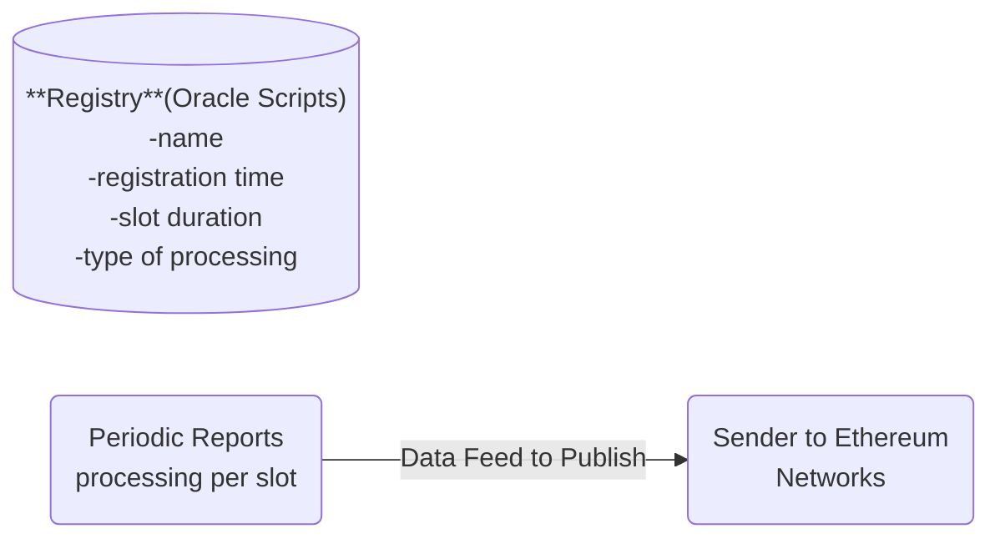

```mermaid
flowchart LR
  A[("**Registry**(Oracle Scripts)<br>-name<br>-registration time<br>-slot duration<br>-type of processing")]
  B(Periodic Reports <br>processing per slot)-->|Data Feed to Publish| C(Sender to Ethereum<br>Networks)
```

